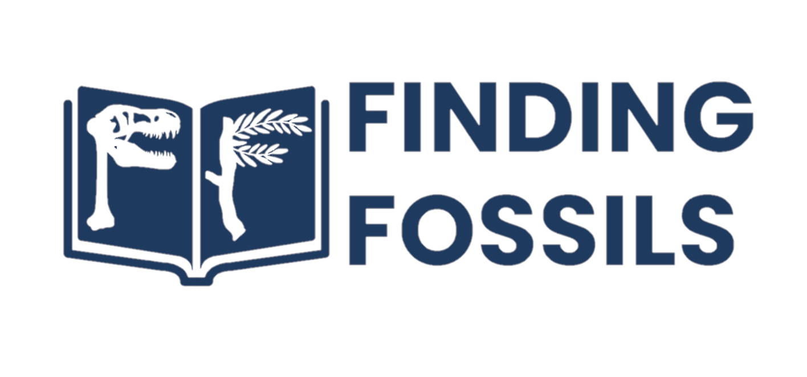
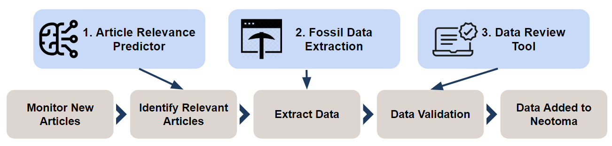
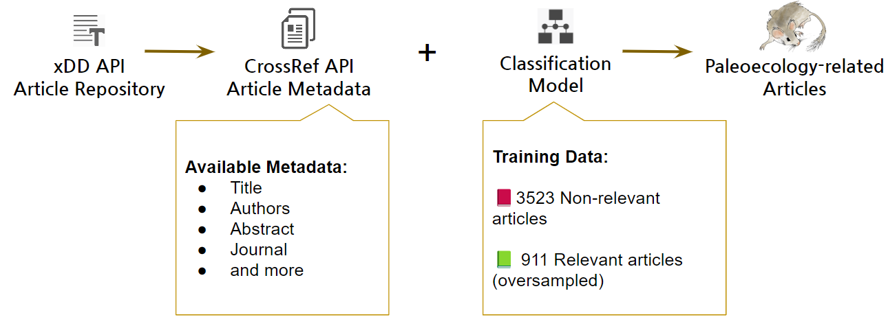
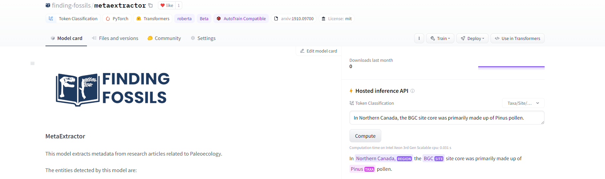
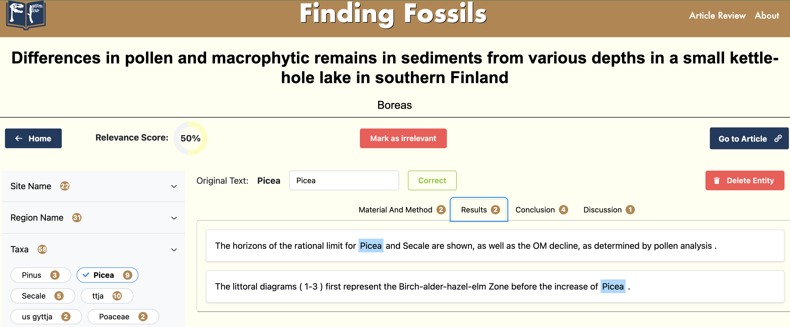

[![Contributors][contributors-shield]][contributors-url]
[![Forks][forks-shield]][forks-url]
[![Stargazers][stars-shield]][stars-url]
[![Issues][issues-shield]][issues-url]
[![MIT License][license-shield]][license-url]
[![codecov][codecov-shield]][codecov-url]


# **MetaExtractor: Finding Fossils in the Literature**

This project aims to identify research articles which are relevant to the [_Neotoma Paleoecological Database_](http://neotomadb.org) (Neotoma), extract data relevant to Neotoma from the article, and provide a mechanism for the data to be reviewed by Neotoma data stewards then submitted to Neotoma. It is being completed as part of the _University of British Columbia (UBC)_ [_Masters of Data Science (MDS)_](https://masterdatascience.ubc.ca/) program in partnership with the [_Neotoma Paleoecological Database_](http://neotomadb.org).

**Table of Contents**

- [**MetaExtractor: Finding Fossils in the Literature**](#metaextractor-finding-fossils-in-the-literature)
  - [About](#about)
    - [Article Relevance Prediction](#article-relevance-prediction)
    - [Data Extraction Pipeline](#data-extraction-pipeline)
    - [Data Review Tool](#data-review-tool)
  - [How to use this repository](#how-to-use-this-repository)
    - [Data Review Tool](#data-review-tool-1)
    - [Article Relevance \& Entity Extraction Model](#article-relevance--entity-extraction-model)
    - [Data Requirements](#data-requirements)
      - [Article Relevance Prediction](#article-relevance-prediction-1)
      - [Data Extraction Pipeline](#data-extraction-pipeline-1)
    - [System Requirements](#system-requirements)
  - [Directory Structure and Description](#directory-structure-and-description)
  - [Contributors](#contributors)
    - [Tips for Contributing](#tips-for-contributing)

There are 3 primary components to this project:

1. **Article Relevance Prediction** - get the latest articles published, predict which ones are relevant to Neotoma and submit for processing.
2. **Data Extraction Pipeline** - extract relevant entities from the article including geographic locations, taxa, etc.
3. **Data Review Tool** - this takes the extracted data and allows the user to review and correct it for submission to Neotoma.

<p align="center">
     
</p>

## **About**

Information on each component is outlined below.

### **Article Relevance Prediction**

The goal of this component is to monitor and identify new articles that are relevant to Neotoma. This is done by using the public [xDD API](https://geodeepdive.org/) to regularly get recently published articles. Article metadata is queried from the [CrossRef API](https://www.crossref.org/documentation/retrieve-metadata/rest-api/) to obtain data such as journal name, title, abstract and more. The article metadata is then used to predict whether the article is relevant to Neotoma or not.

The model was trained on ~900 positive examples (a sample of articles currently contributing to Neotoma) and ~3500 negative examples (a sample of articles unrrelated or closely related to Neotoma). Logistic regression model was chosen for its outstanding performance and interpretability.

Articles predicted to be relevant will then be submitted to the Data Extraction Pipeline for processing.

<p align="center">
     
</p>

To run the Docker image for article relevance prediction pipeline, please refer to the instructions [here](docker/article-relevance/README.md)

The model could be retrained using reviewed article data. Please refer to [here](docker/article-relevance-retrain/README.md) for the instructions.

### **Data Extraction Pipeline**

The full text is provided by the xDD team for the articles that are deemed to be relevant and a custom trained **Named Entity Recognition (NER)** model is used to extract entities of interest from the article.

The entities extracted by this model are:

- **SITE**: name of the excavation site
- **REGION**: more general regions names to provide context for where sites are located
- **TAXA**: plant or animal fossil names
- **AGE**: historical age of the fossils, eg. 1234 AD, 4567 BP
- **GEOG**: geographic coordinates indicating the location of the site, eg. 12'34"N 34'23"W
- **EMAIL**: researcher emails referenced in the articles
- **ALTI**: altitudes of sites, eg. 123 m a.s.l (above sea level)

The model was trained on ~40 existing Paleoecology articles manually annotated by the team consisting of **~60,000 tokens** with **~4,500 tagged entities**.

The trained model is available for inference and further development on huggingface.co [here](https://huggingface.co/finding-fossils/metaextractor).

<p align="center">
     
</p>

### **Data Review Tool**

Finally, the extracted data is loaded into the Data Review Tool where members of the Neotoma community can review the data and make any corrections necessary before submitting to Neotoma. The Data Review Tool is a web application built using the [Plotly Dash](https://dash.plotly.com/) framework. The tool allows users to view the extracted data, make corrections, and submit the data to be entered into Neotoma.

<p align="center">
     
</p>

## How to use this repository

First, begin by installing the requirements.

For pip:

```bash
pip install -r requirements.txt
```

For conda:
```bash
conda env create -f environment.yml
```

If you plan to use the pre-built Docker images, install Docker following these [instructions](https://docs.docker.com/get-docker/)

To launch the app, run the following command from the root directory of this repository:

```bash
docker-compose up --build data-review-tool
```

Once the image is built and the container is running, the Data Review Tool can be accessed at <http://0.0.0.0:8050/>. There is a sample `article-relevance-output.parquet` and `entity-extraction-output.zip` provided for demo purposes.

### **Article Relevance & Entity Extraction Model**

Please refer to the project wiki for the development and analysis workflow details: [MetaExtractor Wiki](https://github.com/NeotomaDB/MetaExtractor/wiki)

### **Data Requirements**

Each of the components of this project have different data requirements. The data requirements for each component are outlined below.

#### **Article Relevance Prediction**

The article relevance prediction component requires a list of journals that are relevant to Neotoma. This dataset used to train and develop the model is available for download [HERE](https://drive.google.com/drive/folders/1NpOO7vSnVY0Wi0rvkuwNiSo3sqq-5AkY?usp=sharing). Download all files and extract the contents into `MetaExtractor/data/article-relevance/raw/`.

The prediction pipeline requires the trained model object. The model is available [HERE](https://drive.google.com/drive/folders/1NpOO7vSnVY0Wi0rvkuwNiSo3sqq-5AkY?usp=sharing). Download the model file and put the .joblib file in `MetaExtractor/models/article-relevance/`.

#### **Data Extraction Pipeline**

As the full text articles provided by the xDD team are not publicly available we cannot create a public link to download the labelled training data. For access requests please contact Simon Goring at <goring@wisc.edu> or Ty Andrews at <ty.elgin.andrews@gmail.com>.

#### **Data Review Tool**

Once the article relevance prediction and data extraction pipeline have been run, the output files can be used as input for the Data Review Tool. The Data Review Tool requires the following files:

- `article-relevance-output.parquet` - output file from the article relevance prediction pipeline
- `entity-extraction-output.zip` - output file from the data extraction pipeline

These files should be present under a single folder and the path to the folder can be updated in the `docker-compose.yml` file, the default location is `data/data-review-tool` directory.

### **System Requirements**

The project has been developed and tested on the following system:

- macOS Monterey 12.5.1
- Windows 11 Pro Version: 22H2
- Ubuntu 22.04.2 LTS


The pre-built Docker images were built using Docker version 4.20.0 but should work with any version of Docker since 4.

## **Directory Structure and Description**

```
├── .github/                            <- Directory for GitHub files
│   ├── workflows/                      <- Directory for workflows
├── assets/                             <- Directory for assets
├── docker/                             <- Directory for docker files
│   ├── article-relevance/              <- Directory for docker files related to article relevance prediction
│   ├── article-relevance-retrain/      <- Directory for docker files related to article relevance retraining
│   ├── data-review-tool/               <- Directory for docker files related to data review tool
│   ├── entity-extraction/              <- Directory for docker files related to named entity recognition
├── data/                               <- Directory for data
│   ├── entity-extraction/              <- Directory for named entity extraction data
│   │   ├── raw/                        <- Raw unprocessed data
│   │   ├── processed/                  <- Processed data
│   │   └── interim/                    <- Temporary data location
│   ├── article-relevance/              <- Directory for data related to article relevance prediction
│   │   ├── raw/                        <- Raw unprocessed data
│   │   ├── processed/                  <- Processed data
│   │   └── interim/                    <- Temporary data location
│   ├── data-review-tool/               <- Directory for data related to data review tool
├── results/                            <- Directory for results
│   ├── article-relevance/              <- Directory for results related to article relevance prediction
│   ├── ner/                            <- Directory for results related to named entity recognition
│   └── data-review-tool/               <- Directory for results related to data review tool
├── models/                             <- Directory for models
│   ├── entity-extraction/              <- Directory for named entity recognition models
│   ├── article-relevance/              <- Directory for article relevance prediction models
├── notebooks/                          <- Directory for notebooks
├── src/                                <- Directory for source code
│   ├── entity_extraction/              <- Directory for named entity recognition code
│   ├── article_relevance/              <- Directory for article relevance prediction code
│   └── data_review_tool/               <- Directory for data review tool code
├── reports/                            <- Directory for reports
├── tests/                              <- Directory for tests
├── Makefile                            <- Makefile with commands to perform analysis
└── README.md                           <- The top-level README for developers using this project.
```

## **Contributors**

This project is an open project, and contributions are welcome from any individual. All contributors to this project are bound by a [code of conduct](https://github.com/NeotomaDB/MetaExtractor/blob/main/CODE_OF_CONDUCT.md). Please review and follow this code of conduct as part of your contribution.

The UBC MDS project team consists of:

- [](https://orcid.org/0009-0003-0699-5838) [Ty Andrews](http://www.ty-andrews.com)
- [](https://orcid.org/0009-0004-2508-4746) Kelly Wu
- [](https://orcid.org/0009-0007-1998-3392) Shaun Hutchinson
- [](https://orcid.org/0009-0007-8913-2403) [Jenit Jain](https://www.linkedin.com/in/jenit-jain-0b31b0160/)

Sponsors from Neotoma supporting the project are:

- [](https://orcid.org/0000-0002-7926-4935) [Socorro Dominguez Vidana](https://ht-data.com/)
- [](https://orcid.org/0000-0002-2700-4605) [Simon Goring](http://www.goring.org)

### Tips for Contributing

Issues and bug reports are always welcome. Code clean-up, and feature additions can be done either through pull requests to [project forks](https://github.com/NeotomaDB/MetaExtractor/network/members) or [project branches](https://github.com/NeotomaDB/MetaExtractor/branches).

All products of the Neotoma Paleoecology Database are licensed under an [MIT License](LICENSE) unless otherwise noted.

[contributors-shield]: https://img.shields.io/github/contributors/NeotomaDB/MetaExtractor.svg?style=for-the-badge
[contributors-url]: https://github.com/NeotomaDB/MetaExtractor/graphs/contributors
[forks-shield]: https://img.shields.io/github/forks/NeotomaDB/MetaExtractor.svg?style=for-the-badge
[forks-url]: https://github.com/NeotomaDB/MetaExtractor/network/members
[stars-shield]: https://img.shields.io/github/stars/NeotomaDB/MetaExtractor.svg?style=for-the-badge
[stars-url]: https://github.com/NeotomaDB/MetaExtractor/stargazers
[issues-shield]: https://img.shields.io/github/issues/NeotomaDB/MetaExtractor.svg?style=for-the-badge
[issues-url]: https://github.com/NeotomaDB/MetaExtractor/issues
[license-shield]: https://img.shields.io/github/license/NeotomaDB/MetaExtractor.svg?style=for-the-badge
[license-url]: https://github.com/NeotomaDB/MetaExtractor/blob/master/LICENSE.txt
[codecov-shield]: https://img.shields.io/codecov/c/github/NeotomaDB/MetaExtractor?style=for-the-badge
[codecov-url]: https://codecov.io/gh/NeotomaDB/MetaExtractor
