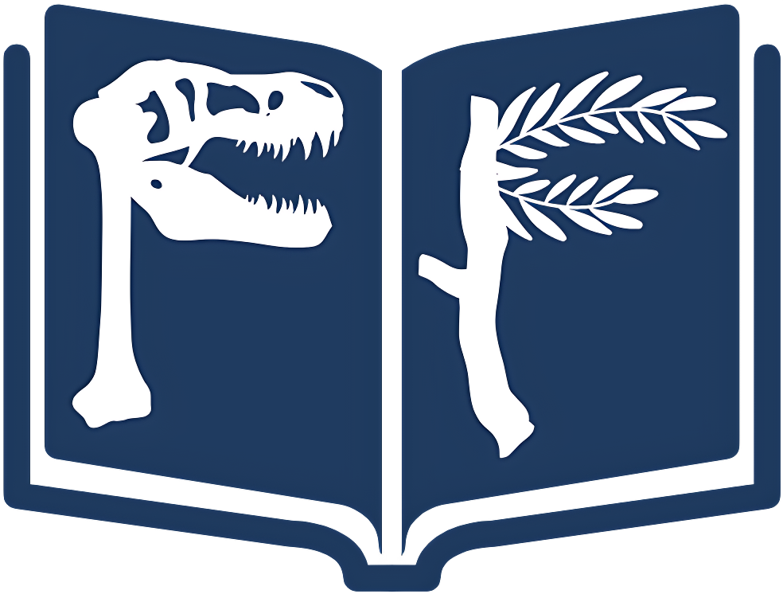

<!-- Improved compatibility of back to top link: See: https://github.com/othneildrew/Best-README-Template/pull/73 -->
<a name="readme-top"></a>
<!--
*** Thanks for checking out the Best-README-Template. If you have a suggestion
*** that would make this better, please fork the repo and create a pull request
*** or simply open an issue with the tag "enhancement".
*** Don't forget to give the project a star!
*** Thanks again! Now go create something AMAZING! :D
-->


<!-- PROJECT SHIELDS -->
<!--
*** I'm using markdown "reference style" links for readability.
*** Reference links are enclosed in brackets [ ] instead of parentheses ( ).
*** See the bottom of this document for the declaration of the reference variables
*** for contributors-url, forks-url, etc. This is an optional, concise syntax you may use.
*** https://www.markdownguide.org/basic-syntax/#reference-style-links
-->
[![Contributors][contributors-shield]][contributors-url]
[![Forks][forks-shield]][forks-url]
[![Stargazers][stars-shield]][stars-url]
[![Issues][issues-shield]][issues-url]
[![MIT License][license-shield]][license-url]


<!-- PROJECT LOGO -->
<br />
<div align="center">
  <a href="https://github.com/NeotomaDB/MetaExtractor">
     
  </a>

<h3 align="center">MetaExtractor: Finding Fossils in the Literature</h3>

  <p align="center">
    This project aims to identify research articles which are relevant to the Neotoma Paleoecological Database, extract data relevant to Neotoma from the article, and provide a mechanism for the data to be reviewed by Neotoma data stewards then submitted to Neotoma.
    <br />
    <a href="https://github.com/NeotomaDB/MetaExtractor"><strong>Explore the docs »</strong></a>
    <br />
    <br />
    <a href="https://github.com/NeotomaDB/MetaExtractor">View Demo</a>
    ·
    <a href="https://github.com/NeotomaDB/MetaExtractor/issues">Report Bug</a>
    ·
    <a href="https://github.com/NeotomaDB/MetaExtractor/issues">Request Feature</a>
  </p>
</div>


<!-- TABLE OF CONTENTS -->
<details>
  <summary>Table of Contents</summary>
  <ol>
    <li>
      <a href="#about-the-project">About The Project</a>
      <ul>
        <li><a href="#built-with">Built With</a></li>
      </ul>
    </li>
    <li>
      <a href="#getting-started">Getting Started</a>
      <ul>
        <li><a href="#prerequisites">Prerequisites</a></li>
        <li><a href="#installation">Installation</a></li>
      </ul>
    </li>
    <li><a href="#usage">Usage</a></li>
    <li><a href="#roadmap">Roadmap</a></li>
    <li><a href="#contributing">Contributing</a></li>
    <li><a href="#license">License</a></li>
    <li><a href="#contact">Contact</a></li>
    <li><a href="#acknowledgments">Acknowledgments</a></li>
  </ol>
</details>


<!-- ABOUT THE PROJECT -->
## About The Project

This project aims to identify research articles which are relevant to the [Neotoma Paleoecological Database](http://neotomadb.org) (Neotoma), extract data relevant to Neotoma from the article, and provide a mechanism for the data to be reviewed by Neotoma data stewards then submitted to Neotoma. It is being completed as part of the University of British Columbia (UBC) [Masters of Data Science (MDS) program](https://masterdatascience.ubc.ca/) in partnership with the [Neotoma Paleoecological Database](http://neotomadb.org).

INSERT SCEENSHOT/GIF HERE

<!-- [![Product Name Screen Shot][product-screenshot]](https://example.com) -->

<p align="right">(<a href="#readme-top">back to top</a>)</p>

### Built With

* [![Python][Python]][Python-url]

<p align="right">(<a href="#readme-top">back to top</a>)</p>


<!-- GETTING STARTED -->
## Getting Started

This is an example of how you may give instructions on setting up your project locally.
To get a local copy up and running follow these simple example steps.

### Prerequisites

This is an example of how to list things you need to use the software and how to install them.
* Python 3.10
  ```sh
  sudo apt-get install python3.10
  ```

### Installation

1. Get a free API Key at [https://example.com](https://example.com)
2. Clone the repo
   ```sh
   git clone https://github.com/NeotomaDB/MetaExtractor.git
   ```
3. Install packages
   ```sh
   pip install -r requirements.txt
   ```
4. Do more things here.

<p align="right">(<a href="#readme-top">back to top</a>)</p>


<!-- USAGE EXAMPLES -->
## Usage

Use this space to show useful examples of how a project can be used. Additional screenshots, code examples and demos work well in this space. You may also link to more resources.

_For more examples, please refer to the [Documentation](https://example.com)_

<p align="right">(<a href="#readme-top">back to top</a>)</p>


<!-- ROADMAP -->
## Roadmap

- [ ] Feature 1
- [ ] Feature 2
- [ ] Feature 3
    - [ ] Nested Feature

See the [open issues](https://github.com/NeotomaDB/MetaExtractor/issues) for a full list of proposed features (and known issues).

<p align="right">(<a href="#readme-top">back to top</a>)</p>


<!-- CONTRIBUTING -->
## Contributing

Contributions are what make the open source community such an amazing place to learn, inspire, and create. Any contributions you make are **greatly appreciated**.

If you have a suggestion that would make this better, please fork the repo and create a pull request. You can also simply open an issue with the tag "enhancement".
Don't forget to give the project a star! Thanks again!

1. Fork the Project
2. Create your Feature Branch (`git checkout -b feature/AmazingFeature`)
3. Commit your Changes (`git commit -m 'Add some AmazingFeature'`)
4. Push to the Branch (`git push origin feature/AmazingFeature`)
5. Open a Pull Request

<p align="right">(<a href="#readme-top">back to top</a>)</p>


<!-- LICENSE -->
## License

Distributed under the MIT License. See `LICENSE.txt` for more information.

<p align="right">(<a href="#readme-top">back to top</a>)</p>


<!-- CONTACT -->
## Contact

Ty Andrews - ty.elgin.andrews@gmail.com

Project Link: [https://github.com/NeotomaDB/MetaExtractor](https://github.com/NeotomaDB/MetaExtractor)

<p align="right">(<a href="#readme-top">back to top</a>)</p>


<!-- ACKNOWLEDGMENTS -->
## Acknowledgments

* [Neotoma Paleoecology Database](http://neotomadb.org)
* [Simon Goring]()
* [Socorro Dominguez]()

<p align="right">(<a href="#readme-top">back to top</a>)</p>


<!-- MARKDOWN LINKS & IMAGES -->
<!-- https://www.markdownguide.org/basic-syntax/#reference-style-links -->
[contributors-shield]: https://img.shields.io/github/contributors/NeotomaDB/MetaExtractor.svg?style=for-the-badge
[contributors-url]: https://github.com/NeotomaDB/MetaExtractor/graphs/contributors
[forks-shield]: https://img.shields.io/github/forks/NeotomaDB/MetaExtractor.svg?style=for-the-badge
[forks-url]: https://github.com/NeotomaDB/MetaExtractor/network/members
[stars-shield]: https://img.shields.io/github/stars/NeotomaDB/MetaExtractor.svg?style=for-the-badge
[stars-url]: https://github.com/NeotomaDB/MetaExtractor/stargazers
[issues-shield]: https://img.shields.io/github/issues/NeotomaDB/MetaExtractor.svg?style=for-the-badge
[issues-url]: https://github.com/NeotomaDB/MetaExtractor/issues
[license-shield]: https://img.shields.io/github/license/NeotomaDB/MetaExtractor.svg?style=for-the-badge
[license-url]: https://github.com/NeotomaDB/MetaExtractor/blob/master/LICENSE.txt
[product-screenshot]: images/screenshot.png
[Python]: https://img.shields.io/badge/python-14354C?style=for-the-badge&logo=python&logoColor=white
[Python-url]: https://www.python.org/
