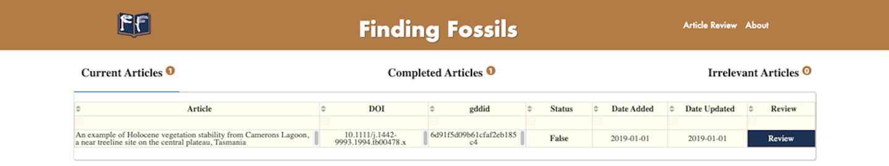
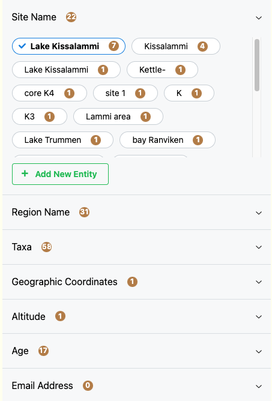
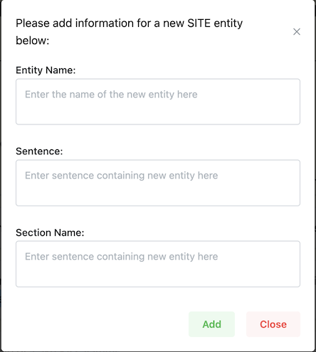

# **Finding Fossils: Data Review Tool**

*Finding Fossils* is data review tool created using Plotly Dash as part of the project and provides a mechanism for the data to be reviewed by Neotoma data stewards then submitted to Neotoma. It is being completed as part of the *University of British Columbia (UBC)* [*Masters of Data Science (MDS)*](https://masterdatascience.ubc.ca/) program in partnership with the [*Neotoma Paleoecological Database*](http://neotomadb.org).

---

### **Directory Structure**
  
```
├── README.md
├── app.py
├── assets
│   ├── about_assets
│   │   ├── accordions.png
│   │   ├── deleted_toggle.png
│   │   ├── entity_review.png
│   │   ├── home.png
│   │   ├── new_entity.png
│   │   └── restore.png
│   ├── finding-fossils-logo-symbol_highres.png
│   ├── finding-fossils.ico
│   └── styles.css
└── pages
    ├── __init__.py
    ├── about.py
    ├── article_review.py
    ├── config.py
    ├── home.py
    ├── navbar.py
    └── not_found_404.py
```
---
## **Dashboard Deployment**
---
To be completed

---
## **App Demo**
---

https://github.com/NeotomaDB/MetaExtractor/assets/112443522/7e986e55-3d04-4e2b-aa27-0188def89196

---

## **Page Navigation**
---
### **Home Page**

From the home page, users can access three main tabs of data articles that have been extracted for review. 
1. **Current Articles** are articles that are ready for review. Those with a status **False** have not been reviewed yet. Those with a status **In Progress** are articles that have reviews started and changes saved, but the review is not yet complete.

2. **Completed Articles** are those articles that have been reviewed and submitted. Changes can still be made if you open these files and click **Submit**, or **Save** which changes the status of the file to **In Progress** again.

3. **Irrelevant Articles** are not relevant to the Neotoma Database and have been extracted accidentally (false positives). These articles can be used to retrain the article relevance model for improved accuracy.



---

### **Article Review**

Once an article has been selected from the Home Page, the user is directed to the article relevance page. Several functionalities have been implemented to ensure a quick traversal and verification of an article. Few of the key features included are listed below, please refer to the demo video above for a detailed walkthrough.
- **Home**: button to return to the Home Page.
- **Relevance Score**: indicator showing the prediction results from the article relevance model.
- **Mark as irrelevant**: button to move the article to the Irrelevant Articles tab on the Home Page. This will remove the article from the queue of articles to be reviewed and can be used to retrain the article relevance model.
- **Go to Article**: button to open the article in a new tab.
- **Save**: button to save your changes but not submit the article. This will save your changes and will keep the article in the **Current Articles** tab on the Home Page with a status of **In Progress**.
- **Submit**: button to submit the article once the review of the article is complete. This will save all of the changes that you have made to the article and will move the article to the **Completed Articles** tab on the Home Page.

Following are different ways a data steward can interact with the extracted data

1. `Reviewing the Article`:
On the left hand side of the page, there are accordions for each entity type found in the article. The number displayed beside the entity type indicates how many different entities are found in the article. Clicking on the accordion will open the list of entities. Clicking on the entity will open the entity review page that lists the section tabs under which the entities occur along with the corresponding sentences.

<div style="display: flex; justify-content: center;">
  
</div>
<br/>

2. `Entity Review`:
On the entity review page, you will see the **Original Text** which will display the label that the Entity Extraction model has extracted. Below this will be tabs of each of the sections of the journal article that this entity has been found in. Under each tab will be the sentences in which the entity has been found. The entity has been highlighted in blue. As a result of the scanning of articles from PDFs through Optical Character Recognition there could be issues with the text. If you see any issues with the text, you can edit the text in the text box below the sentence. Once you have made your changes, you can click the **Correct** button to save your changes. If you would like to delete the entity, you can click the **Delete** button. This will remove the entity from the accordion and will be reflected in the entity count on the left hand side of the article review page. If the entity is correct, simply move on to the next entity.


<br/>

3. `Adding a new entity`: 
If through the process of reviewing the article you come across an entity that was not extracted by the Entity Extraction model, you can add a new entity. To do this, click the **Add New Entity** button. This will open a popup in which you can add the entity you have found. The information that you need to include here is the **Entity Name**, the **Sentence** that you found this entity in, as well as the **Section Name** of the article it was found in. Once you have added the necessary information, click the **Add** button. This will add the entity to the entity list on the left hand side of the article review page. You can then click on the entity to open the entity review page and make any changes to the entity that you would like.

<div style="display: flex; justify-content: center;">
  
</div>
<br/>

4. `Restoring an entity`:
If you have deleted an entity by accident, you can restore the entity. To do this, select the **Show deleted entity** button on the below the accordions. From there, select the entity and click the **Restore** button on the entity review page. This will restore the entity to the entity list on the left hand side of the article review page.

<div style="display: flex; justify-content: center;">
  
</div>
<br/>

<div style="display: flex; justify-content: center;">
  
</div>
<br/>

