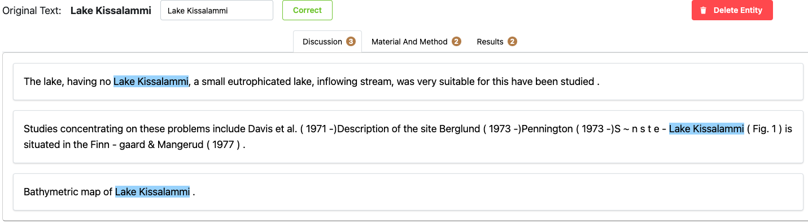
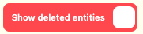

# Finding Fossils: Data Review Tool

Finding Fossils is data review tool created using Plotly Dash as part of the project and provides a mechanism for the data to be reviewed by Neotoma data stewards then submitted to Neotoma. It is being completed as part of the University of British Columbia (UBC) [Masters of Data Science (MDS) program](https://masterdatascience.ubc.ca/) in partnership with the [Neotoma Paleoecological Database](http://neotomadb.org).

## Dashboard Deployment

To be completed

## How the app works

### App Demo

https://github.com/NeotomaDB/MetaExtractor/assets/112443522/bfa966a7-8a6c-4cdc-b3d0-c1b5b0672a57

### Home Page

From the home page, you can access three main tabs of data articles that have been extracted for review. The first is Current Articles which are articles that are ready for review. Those with a Status of "False" have not been reviewed yet. Those with a Status of "In Progress" are articles that have reviews started and changes saved, but the review is not yet complete.

The next tab are Completed Articles are those that have reviews completed and have been submitted. They can still have changes made if you open these files and hit "Submit" or "Save" to make the file "In Progress again".

The third tab are Irrelevant Articles. These articles are not relevant to the Neotoma Database and have been extracted accidentally. These articles will be used to retrain the article relevance model for greater accuracy.

### Article Review

Once an articles has been selected from the Home Page, you will be brought to the article relevance page. At the top of the page, you will see the article title and authors. Below that you can see the Button to return to the Home Page, the Relevance score predicted by the article relevance model. From there you can also select the "Mark as irrelevant" button to move the article to the Irrelevant Articles tab on the Home Page. This will remove the article from the queue of articles to be reviewed and can be used to retrain the article relevance model. In addition, there is a button to "Go to Article" which will open the article in a new tab.

### Reviewing the Article

On the left hand side of the article, there are accordions for each entity type found in the article. The number displayed beside the entity type indicates how many different entities are found in the article. Clicking on the accordion will open the list of entities. Clicking on the entity will open the entity review page. 

### Entity Review

On the entity review page, you will see the Original Text which will display the label that the Entity Extraction model has extracted. Below this will be tabs of each of the sections of the journal article that this entity has been found. Under each tab will be the sentences in which the entity has been found. The entity has been highlighted in blue. As a result of the scanning of articles from PDFs through Optical Character Recognition there could be issues with the text. If you see any issues with the text, you can edit the text in the text box below the sentence. Once you have made your changes, you can click the "Correct" button to save your changes. If you would like to delete the entity, you can click the "Delete" button. This will remove the entity from the accordion and will be reflected in the entity count on the left hand side of the article review page. If the entity is correct, simply move on to the next entity.

### Adding a new entity

If through the process of reviewing the article you come across an entity that was not extracted by the Entity Extraction model, you can add a new entity. To do this, click the "Add New Entity" button. This will open a popup in which you can add the entity you have found. The information that you need to include here is the Entity Name, the Sentence that you found this entity in, as well as the Section Name of the article it was found in. Once you have added the necessary information, click the "Add" button. This will add the entity to the entity list on the left hand side of the article review page. You can then click on the entity to open the entity review page and make any changes to the entity that you would like.

### Restoring an entity

If you have deleted an entity by accident, you can restore the entity. To do this, select the "Show deleted entity button on the below the accordions.

From there, select the entity and click the "Restore" button on the entity review page. This will restore the entity to the entity list on the left hand side of the article review page.

### Submitting the Article

Once the review of the article is complete, you can submit the article. To do this, click the "Submit" button at the top of the page. This will save all of the changes that you have made to the article and will move the article to the Completed Articles tab on the Home Page. If you would like to save your changes but not submit the article, you can click the "Save" button. This will save your changes and will keep the article in the Current Articles tab on the Home Page with a status of "In Progress".
