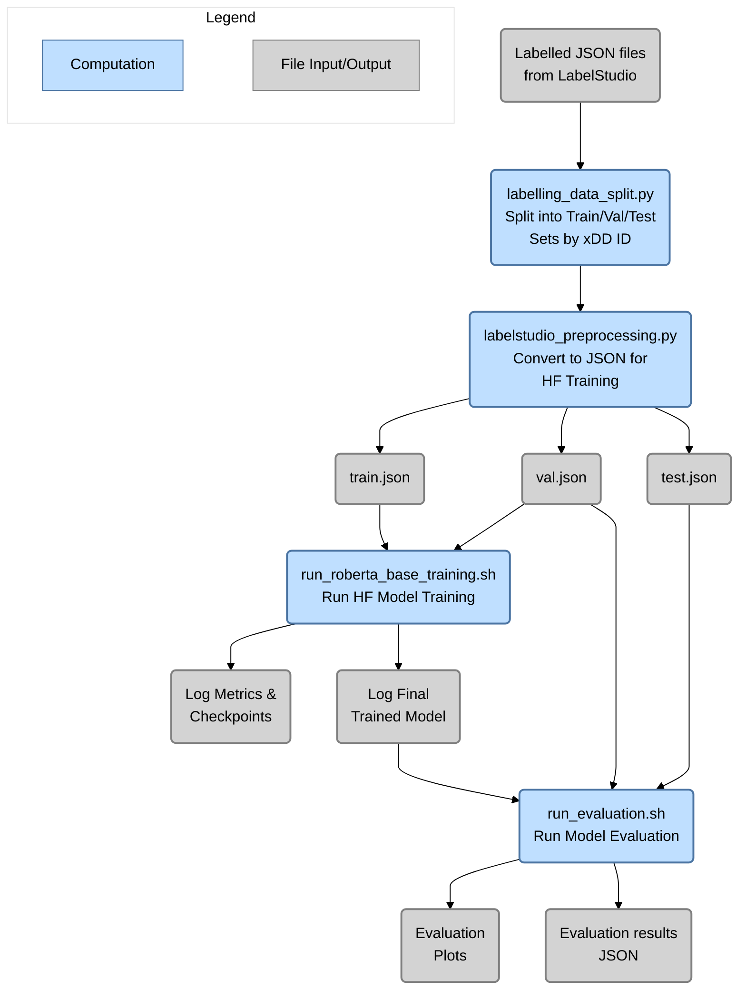

<!---
Copyright 2020 The HuggingFace Team. All rights reserved.

Licensed under the Apache License, Version 2.0 (the "License");
you may not use this file except in compliance with the License.
You may obtain a copy of the License at

    http://www.apache.org/licenses/LICENSE-2.0

Unless required by applicable law or agreed to in writing, software
distributed under the License is distributed on an "AS IS" BASIS,
WITHOUT WARRANTIES OR CONDITIONS OF ANY KIND, either express or implied.
See the License for the specific language governing permissions and
limitations under the License.
-->

# HuggingFace Token Classification Training & Evaluation

This folder contains the training and evaluation scripts for the HuggingFace Token Classification models. The scripts are based on the HuggingFace Token Classification scripts and have been modified to work with the Label Studio output format and optionally log to Azure ML MLflow. Original code adopted from here on May 23, 2023: https://github.com/huggingface/transformers/tree/main/examples/pytorch/token-classification

**Table of Contents**
- [HuggingFace Token Classification Training \& Evaluation](#huggingface-token-classification-training--evaluation)
  - [Training Workflow](#training-workflow)
  - [Evaluation Workflow](#evaluation-workflow)
  - [Overall Process Diagram](#overall-process-diagram)
  - [Improvements/Adjustments Over Original HuggingFace Code](#improvementsadjustments-over-original-huggingface-code)
  - [How to Run Training on Free Google Colab with GPU](#how-to-run-training-on-free-google-colab-with-gpu)
- [Original HuggingFace Documentation: Token classification](#original-huggingface-documentation-token-classification)
  - [PyTorch version](#pytorch-version)
  - [Old version of the script](#old-version-of-the-script)
  - [Pytorch version, no Trainer](#pytorch-version-no-trainer)

## Training Workflow

The training workflow is as follows:
1. If not already done, run the `labelling_data_split.py` script to split the Label Studio output files into train/test/val sets.
   1. This script will split the data into train/test/val sets and save them as individual JSON files in their own folders.
2. Next. run the `labelstudio_preprocessing.py` script to preprocess the Label Studio output files into the format required by the HuggingFace Token Classification scripts.
   1. This takes individual JSON files (txt file extension from Azure export) and combines them into a single JSON file for train/test/val sets.
3. Next, open and update the fields in the `run_roberta_base_training.sh` script to define the following key values:
   1. `LABELLED_FILE_LOCATION` - The location of the JSON file containing split train/test/val Label Studio output data.
   2. `OUTPUT_DIR` - where to save the model checkpoints and final model files
   3. `LOG_DIR` - where to save the training logs should errors stop training
   4. (optional) `MLFLOW_EXPERIMENT_NAME` - if this is defined, training will try to connect to the MLflow URI located in the repository `.env` file, **comment this line out if you don't want to use MLflow or don't have it setup**
   5. (optional) `HF_MLFLOW_LOG_ARTIFACTS` - this defines whether model weights get logged to mlflow for checkpoints, recommended to leave disabled (`"0"`) as the upload time for ~1GB model checkpoints is slow, instead just use the locally saved model files
4. Start the training running by starting the bashscript `run_roberta_base_training.sh` script.
   1. This will start the training and log the results to the `LOG_DIR` folder.
   2. If MLflow is enabled, the results will also be logged to MLflow.

## Evaluation Workflow

TO run full evaluation of the trained model to get detailed metrics and plots, follow these steps:
1. Open the `run_evaluation.sh` bash script and update the following fields:
   1. `MODEL_NAME` - the name to be assigned and put into the results file names etc.
   2. `MODEL_PATH` - the location of the trained model files, including a`pytorch.bin` file and a `config.json` file
   3. `OUTPUT_DIR` - the location to save the evaluation results
   4. `DATA_DIR` - the location of the JSON file containing split train/test/val Label Studio output data.
2. Run the bash script fro the CLI and results will be generated in the `OUTPUT_DIR` folder. **This may take while on CPU and even GPU.**

## Overall Process Diagram



## Improvements/Adjustments Over Original HuggingFace Code
The following improvements were added to the tools linked above:
1. Incorporating custom evaluation metrics beyond standard precision/recall
   1. Adding in token/entity based recall and precision metrics being reported
2. The ability to log models and metrics to an Azure ML workspace MLflow instance was added and requiring environment variables to be set and the azureml-mlflow package to be installed to log.
   1. The environnment variables AZURE_TENANT_ID, AZURE_CLIENT_ID, AZURE_CLIENT_SECRET and AZURE_MLFLOW_TRACKING_URI must be set using the .env file in the root of the repo.

## How to Run Training on Free Google Colab with GPU

This notebook sets up the NER model training on Google Colab with GPU. Use the following steps to create the setup/folder structure and run the training. THe free level of Colab does not allow CLI so a notebook is used to start the training.

1. Create a folder in your Google Drive and name it the name of your training run (e.g. `roberta-base-v1`)
2. Upload the entire `src` folder from the repo into the folder you just created
3. Create a `data` folder inside the folder you just created and upload the `train.json` and `val.json` files into it
4. Create a `models` folder with a `logs` folder inside of it, this is where checkpoints will be saved during training
5. Create an `evaluation-results` folder, this is where the evaluation results will be saved
6. Create a copy of the `run_training.sh` and `run_evaluation.sh` files from `src/entity_extraction/training/huggingface` and place it in training run folder
7. Your folder structure should now look like:
   ```
   roberta-base-v1
   ├── data
   │   ├── train.json
   │   └── val.json
   ├── models
   │   └── logs
   ├── evaluation-results
   ├── src
   ├── colab_start_training.ipynb
   ├── run_evaluation.sh
   └── run_training.sh
   ```
8. Open the `run_training.sh` and `run_evaluation.sh` files and change each of the variables/paths to match your current setup.
9. Open the `colab_start_training.ipynb` file and run the cells to start training.
10. Model files and checkpoints will be saved in the `models` folder and evaluation results will be saved in the `evaluation-results` folder.

# Original HuggingFace Documentation: Token classification

## PyTorch version

Fine-tuning the library models for token classification task such as Named Entity Recognition (NER), Parts-of-speech
tagging (POS) or phrase extraction (CHUNKS). The main scrip `run_ner.py` leverages the 🤗 Datasets library and the Trainer API. You can easily
customize it to your needs if you need extra processing on your datasets.

It will either run on a datasets hosted on our [hub](https://huggingface.co/datasets) or with your own text files for
training and validation, you might just need to add some tweaks in the data preprocessing.

The following example fine-tunes BERT on CoNLL-2003:

```bash
python run_ner.py \
  --model_name_or_path bert-base-uncased \
  --dataset_name conll2003 \
  --output_dir /tmp/test-ner \
  --do_train \
  --do_eval
```

or just can just run the bash script `run.sh`.

To run on your own training and validation files, use the following command:

```bash
python run_ner.py \
  --model_name_or_path bert-base-uncased \
  --train_file path_to_train_file \
  --validation_file path_to_validation_file \
  --output_dir /tmp/test-ner \
  --do_train \
  --do_eval
```

**Note:** This script only works with models that have a fast tokenizer (backed by the 🤗 Tokenizers library) as it
uses special features of those tokenizers. You can check if your favorite model has a fast tokenizer in
[this table](https://huggingface.co/transformers/index.html#supported-frameworks), if it doesn't you can still use the old version
of the script.

> If your model classification head dimensions do not fit the number of labels in the dataset, you can specify `--ignore_mismatched_sizes` to adapt it.

## Old version of the script

You can find the old version of the PyTorch script [here](https://github.com/huggingface/transformers/blob/main/examples/legacy/token-classification/run_ner.py).

## Pytorch version, no Trainer

Based on the script [run_ner_no_trainer.py](https://github.com/huggingface/transformers/blob/main/examples/pytorch/token-classification/run_ner_no_trainer.py).

Like `run_ner.py`, this script allows you to fine-tune any of the models on the [hub](https://huggingface.co/models) on a
token classification task, either NER, POS or CHUNKS tasks or your own data in a csv or a JSON file. The main difference is that this
script exposes the bare training loop, to allow you to quickly experiment and add any customization you would like.

It offers less options than the script with `Trainer` (for instance you can easily change the options for the optimizer
or the dataloaders directly in the script) but still run in a distributed setup, on TPU and supports mixed precision by
the mean of the [🤗 `Accelerate`](https://github.com/huggingface/accelerate) library. You can use the script normally
after installing it:

```bash
pip install git+https://github.com/huggingface/accelerate
```

then

```bash
export TASK_NAME=ner

python run_ner_no_trainer.py \
  --model_name_or_path bert-base-cased \
  --dataset_name conll2003 \
  --task_name $TASK_NAME \
  --max_length 128 \
  --per_device_train_batch_size 32 \
  --learning_rate 2e-5 \
  --num_train_epochs 3 \
  --output_dir /tmp/$TASK_NAME/
```

You can then use your usual launchers to run in it in a distributed environment, but the easiest way is to run

```bash
accelerate config
```

and reply to the questions asked. Then

```bash
accelerate test
```

that will check everything is ready for training. Finally, you can launch training with

```bash
export TASK_NAME=ner

accelerate launch run_ner_no_trainer.py \
  --model_name_or_path bert-base-cased \
  --dataset_name conll2003 \
  --task_name $TASK_NAME \
  --max_length 128 \
  --per_device_train_batch_size 32 \
  --learning_rate 2e-5 \
  --num_train_epochs 3 \
  --output_dir /tmp/$TASK_NAME/
```

This command is the same and will work for:

- a CPU-only setup
- a setup with one GPU
- a distributed training with several GPUs (single or multi node)
- a training on TPUs

Note that this library is in alpha release so your feedback is more than welcome if you encounter any problem using it.
