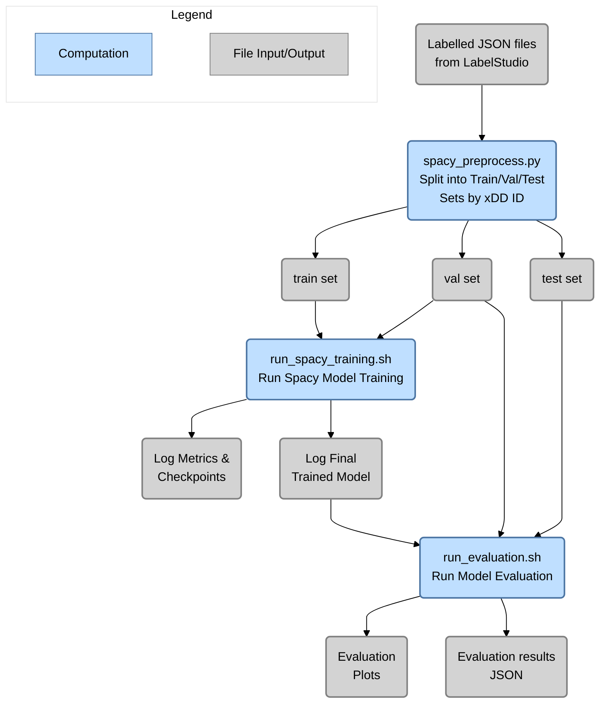

# SpaCy Transformer Training & Evaluation

This folder contains the training and evaluation scripts for the SpaCy Transformer based NER model. The scripts are based on the SpaCy CLI scripts and have been modified to work with the Label Studio output format. More information can be found [here](https://spacy.io/usage/training)

**Table of Contents**
- [SpaCy Transformer Training \& Evaluation](#spacy-transformer-training--evaluation)
  - [Training Workflow](#training-workflow)
  - [Evaluation Workflow](#evaluation-workflow)
  - [Overall Process Diagram](#overall-process-diagram)
  - [How to Run Training on Free Google Colab with GPU](#how-to-run-training-on-free-google-colab-with-gpu)

## Training Workflow

A bash script is used to initialize a training job. Model training is fully customizable and users are encouraged to update the parameters in the `run_spacy_training.sh` and `spacy_transfomer_train.cfg` files prior to training. The training workflow is as follows:
1. Create a new data directory and dump all the JSON files containing annotations from Label Studio and any reviewed parquet files.
2. Most parameters can be used with the default value, open the `run_spacy_training.sh` bash script and update the following fields with absolute paths or relative paths from the root of the repository:
   - `DATA_PATH`: path to directory with Label Studio labelled data
   - `DATA_OUTPUT_PATH`: path to directory to store the split dataset (train/val/test) as well as other data artifacts required for training.
   - `MODEL_OUTPUT_PATH`: path to store new model artifacts
   - `VERSION`: Version can be updated to keep track of different training runs.
   - `--gpu-id`: While executing the `spacy train` command, GPU can be used, if available, by setting this flag to **0**.
3. Make the training script executable: 
```bash
chmod +x src/entity_extraction/training/spacy/run_spacy_training.sh
```
4. Execute the training script from the : 
```bash
./src/entity_extraction/training/spacy/run_spacy_training.sh
```

## Evaluation Workflow

To run full evaluation of the trained model to get detailed metrics and plots, follow these steps:
1. Open the `run_evaluation.sh` bash script and update the following fields:
   1. `MODEL_NAME` - the name to be assigned and put into the results file names etc.
   2. `MODEL_PATH` - the location of the trained model files.
   3. `OUTPUT_DIR` - the location to save the evaluation results.
   4. `DATA_DIR` - the location of the JSON file containing split train/test/val Label Studio output data.
   5. `GPU` - whether to use GPU or not.
2. Make the evaluation script executable: 
```bash
chmod +x src/entity_extraction/training/spacy/run_evaluation.sh
```
3. Run the evaluation script results will be generated in the `OUTPUT_DIR` folder. **This may take while on CPU and even GPU.**
```bash
./src/entity_extraction/training/spacy/run_evaluation.sh
```

## Overall Process Diagram



## How to Run Training on Free Google Colab with GPU

This notebook sets up the NER model training on Google Colab with GPU. Use the following steps to create the setup/folder structure and run the training. The free level of Colab does not allow CLI so a notebook is used to start the training.

1. Create a folder in your Google Drive and name it the name of your training run (e.g. `spacy-transformer-v1`)
2. Upload the entire `src` folder from the repo into the folder you just created
3. Create a `data` folder inside the folder you just created and upload the `train.spacy` and `val.spacy` files into it
4. Create a `models` folder, this is where checkpoints will be saved during training
5. Create an `evaluation-results` folder, this is where the evaluation results will be saved
6. Create a copy of the `run_spacy_training.sh` and `run_evaluation.sh` files from `src/entity_extraction/training/spacy` and place it in training run folder
7. Your folder structure should now look like:
   ```
   spacy-transformer-v1
   ├── data
   │   ├── train.spacy
   │   └── val.spacy
   ├── models
   ├── evaluation-results
   ├── src
   ├── colab_start_training.ipynb
   ├── run_evaluation.sh
   └── run_spacy_training.sh
   ```
8. Open the `run_spacy_training.sh` and `run_evaluation.sh` files and change each of the variables/paths to match your current setup. (Note: Google Colab expects absolute paths in the both the files)
9. Open the `colab_start_training.ipynb` file and run the cells to start training.
10. Model files and checkpoints will be saved in the `models` folder and evaluation results will be saved in the `evaluation-results` folder.